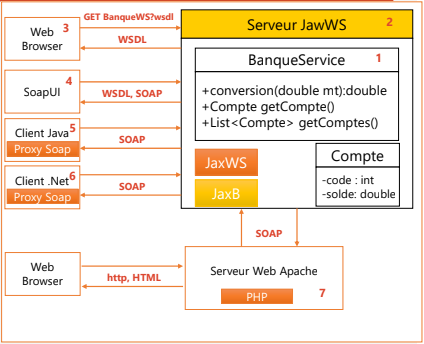
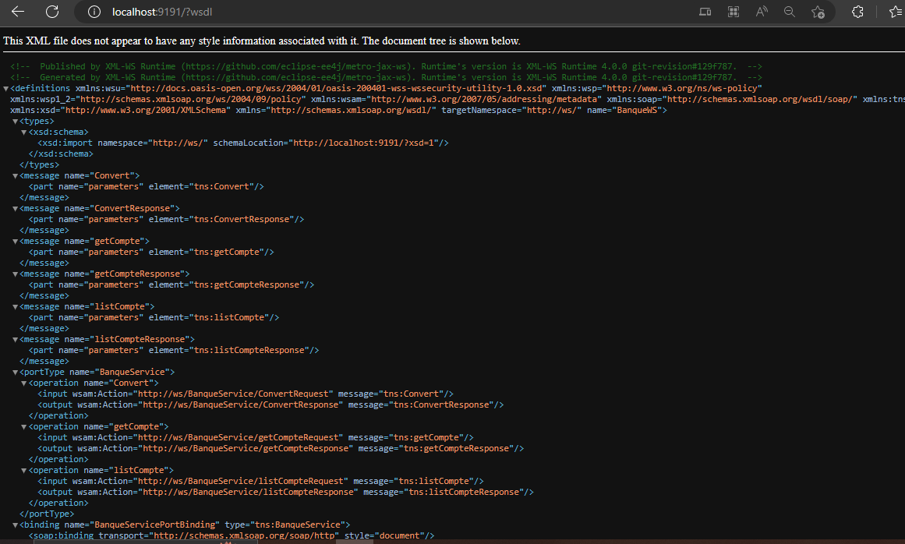
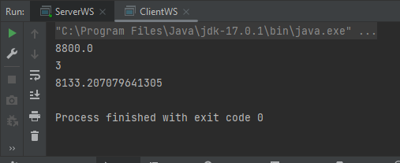
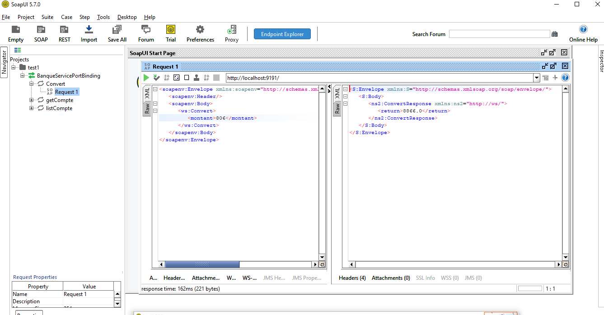
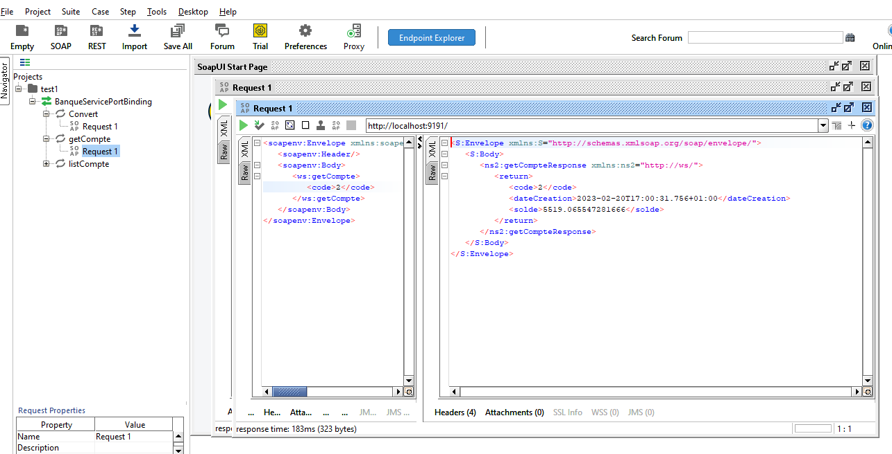
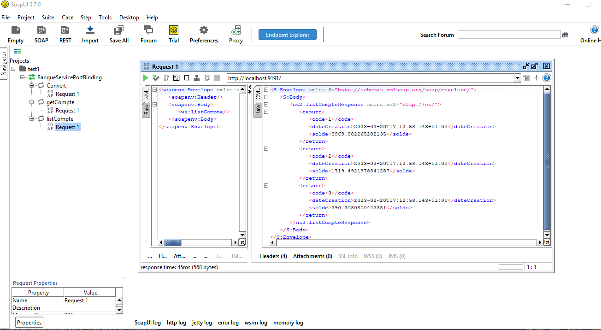

<h1>Distributed System Web Services </h1>

  Asmae EL HYANI  Distributed System & Artificial Intelligence Master’s  ENSET Mohammedia

   
<h2>Introduction</h2>

This is a simple Java web service built using the Jakarta XML Web Services API. The web service, called "BanqueService", provides three methods: "conversion", "getCompte", and "listCompte".

The "conversion" method takes a double value as input and returns its conversion to a different currency. The "getCompte" method takes an integer value as input and returns a random bank account object. The "listCompte" method returns a list of three randomly generated bank account objects.

This web service can be tested using a Java client or the SOAPUI client tool.</pre>

    
<ol type="I">
  <h2><li >Class</li></h2>
 <ol type="1">
    <h3><li>ServerWS</li></h3>
<pre>public class ServerWS {
    public static void main(String[] args) {
        Endpoint.publish("http://0.0.0.0:9191/",new BanqueService());  //publish small server
        System.out.println("Web service deployed on http://0.0.0.0:9191/ ");
    }
}</pre>
    <h3><li>BanqueService</li></h3>
<pre>@WebService(serviceName = "BanqueWS")
public class BanqueService {
    @WebMethod(operationName = "Convert")
    public double  conversion(@WebParam(name = "montant") double mt){
        return mt*11;
    }
    @WebMethod
    public Compte getCompte(@WebParam(name = "code")int code){
        return new Compte(code,Math.random()*9888,new Date());
    }
    @WebMethod
    public List<'Compte> listCompte(){
        return List.of(
                new Compte(1,Math.random()*9888,new Date()),
                new Compte(2,Math.random()*9888,new Date()),
                new Compte(3,Math.random()*9888,new Date())
        );
    }
}
</pre>
    <h3><li>Compte</li></h3>
<pre>@XmlRootElement(name = "compte")
@XmlAccessorType(XmlAccessType.FIELD)
public class Compte {
    private int code;
    private double solde;
    //for egnoring date use @XmlTransient
    @XmlTransient
    private Date dateCreation;
    public Compte(int code, double solde, Date dateCreation) {
        this.code = code;
        this.solde = solde;
        this.dateCreation = dateCreation;
    }
    public Compte() {
    }
    public int getCode() {
        return code;
    }
    public void setCode(int code) {
        this.code = code;
    }
    public double getSolde() {
        return solde;
    }
    public void setSolde(double solde) {
        this.solde = solde;
    }
    public Date getDateCreation() {
        return dateCreation;
    }
    public void setDateCreation(Date dateCreation) {
        this.dateCreation = dateCreation;
    }
}</pre>
    <h3><li>Client</li></h3>
<pre>public class ClientWS {
    public static void main(String[] args) {
        BanqueService stub=new BanqueWS().getBanqueServicePort();
        System.out.println(stub.convert(800));
        Compte cp=stub.getCompte(3);
        System.out.println(cp.getCode());
        System.out.println(cp.getSolde());
    }
}
</pre>
</ol>
<h2><li >Test</li></h2>
 <ol type="1">
    <h3><li>Consult and analyze the WSDL with an HTTP Browser</li></h3>
    
Write "http://localhost:9191/?wsdl" in your browser, you will see the same result as in the picture below

    
    <h3><li>With client.java</li></h3>
    
    <h3><li>With SOAPUI client</li></h3>
    <ul type="circle">
        <h4><li>Convert methode</li></h4>
            
        <h4><li>getCompte methode</li></h4>
            
        <h4><li>listCompte methode</li></h4>
            
    </ul>
</ol>
</ol>

<h2>Conclusion</h2>

In conclusion, a web service is a software system designed to allow communication between different applications or systems over the internet. It provides a standardized way for applications to exchange data and perform operations, regardless of the programming language or platform used by each application. Web services can use different protocols and formats, such as SOAP, REST, XML, and JSON, to enable communication and data exchange. They are widely used in various domains, such as e-commerce, finance, healthcare, and many others, to integrate systems and share data in a secure and efficient way. Overall, web services play a critical role in enabling interoperability and connectivity among diverse systems and applications in today's digital world.

